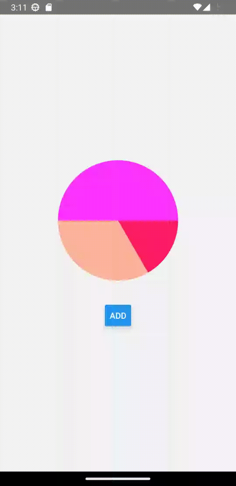
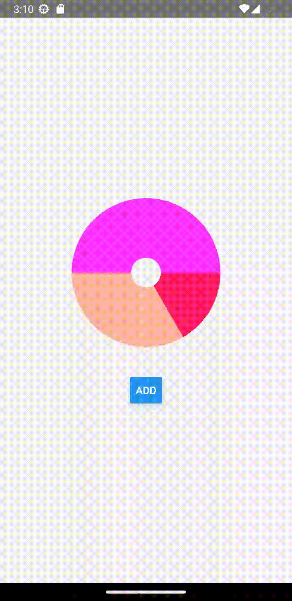

# React Native Animated Pie Chart

Animated Pie Chart for React Native





## Installation

```sh
npm install rn-animated-pie-chart
```

React Native Animated Pie Chart is made up of some core utilities and those are then used by it to draw and animate the pie chart. Let's also install and configure dependencies used by this library.

### Installing dependencies

In your project directory, run:

```sh
npm install react-native-svg
npm install react-native-reanimated
```

Add Reanimated's babel plugin to your "babel.config.js":

```js
module.exports = {
    presets: [
      ...
    ],
    plugins: [
      ...
      'react-native-reanimated/plugin', // add this line
    ],
  };
```

For aditional instructions please visit [React Native Reanimated](https://docs.swmansion.com/react-native-reanimated/docs/fundamentals/installation/) and [React Native SVG](https://github.com/software-mansion/react-native-svg#installation)

## Usage

```js
import { PieChart, AnimatedPieChart } from 'rn-animated-pie-chart';

// ...

    <PieChart data={[10, 20]} /> // no animated
    <AnimatedPieChart
          data={[10, 20, 30]}
          colors={['red', 'blue', 'green']}
          size={200}
          holeSize={20}
        />
```

## Props

| Property   | Type     | Default           | Description                                                    |
| ---------- | -------- | ----------------- | -------------------------------------------------------------- |
| data       | number[] | **Required**      | An array of the data entries, each value must be a number      |
| colors     | number[] | predifened colors | An array of colors, it should have the same length as the data |
| size       | number   | 100               | The chart size in pixels                                       |
| holeSize   | number   | 0                 | The size of the doughnut hole in pixels                        |
| startAngle | number   | 0                 | The start angle in degrees of the entire pie                   |
| endAngle   | number   | 360               | The end angle in degrees of the entire pie                     |

## License

MIT

---

Made with [create-react-native-library](https://github.com/callstack/react-native-builder-bob)
